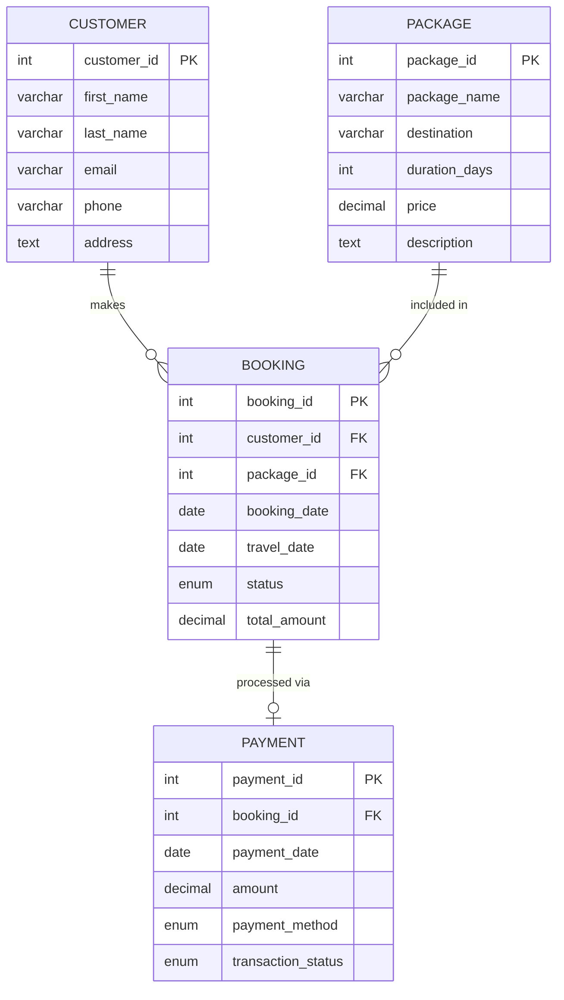

# Travel Management System
**RDBMS Mini Project**

## Description
The Travel Management System is a database-driven mini-project designed to streamline the operations of a travel agency. It properly manages and tracks Customers, Travel Packages, Bookings, and Payments using a normalized Relational Database structure in MySQL.

## Features
- **Customer Management:** Maintain records of all travelers and agencies.
- **Package Management:** Add and update various travel itineraries, lengths, and pricing.
- **Booking Management:** Assign travel packages to customers and maintain booking lifecycles (`Pending`, `Confirmed`, `Cancelled`).
- **Payment Processing:** Record transactions linked to specific bookings, detailing the method and success of the payment.
- **Data Integrity:** Strict usage of Primary constraints, Foreign Keys, and exact data types. CASCADING deletions have been implemented.

## Entity-Relationship Diagram

## Technologies Used
- **Database Management System:** MySQL
- **Concepts Applied:** Normalization (1NF, 2NF, 3NF), Primary & Foreign Keys, Aggregations, Joins, Subqueries.
- **Language:** SQL (Structured Query Language)

## Example Queries
The underlying SQL code covers essential capabilities, including:
- Fetching customers mapped to package details using `JOIN`.
- Generating total revenue using `SUM()` and `GROUP BY`.
- Identifying high-value customers via `Subqueries`.

## Author
*Created as an Academic B.Tech Mini Project for RDBMS evaluation.*
